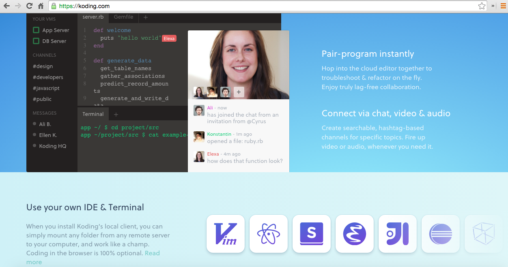
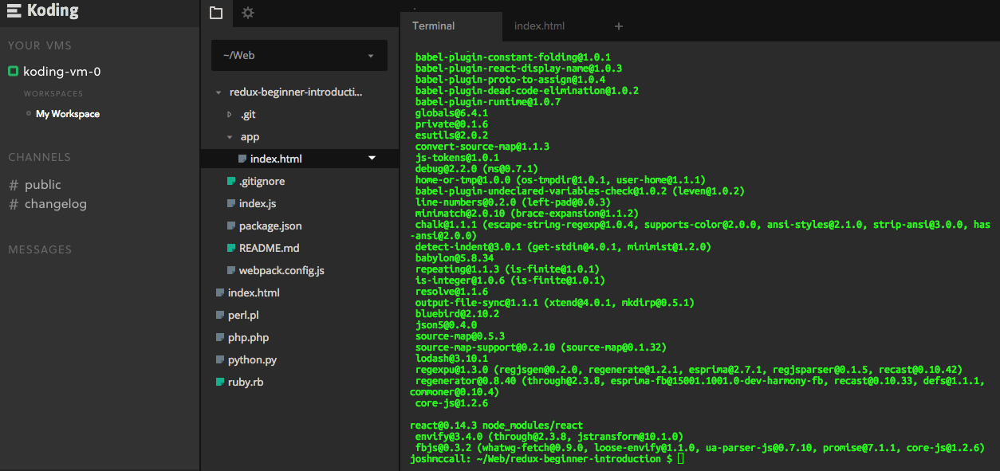
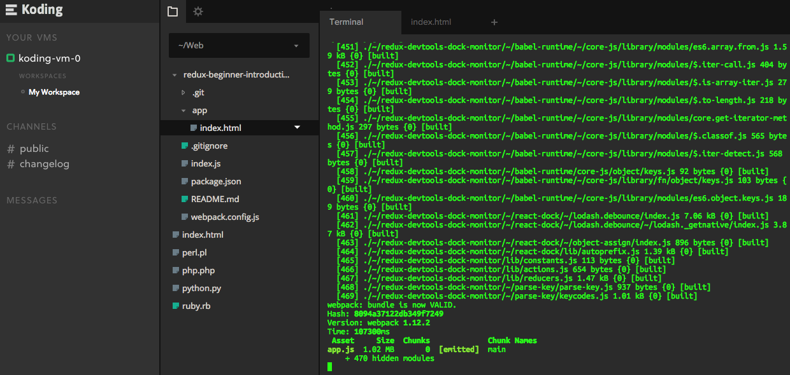
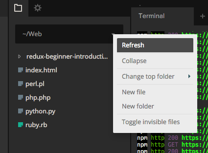
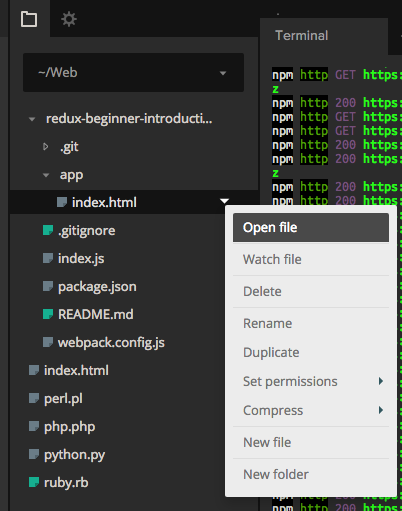
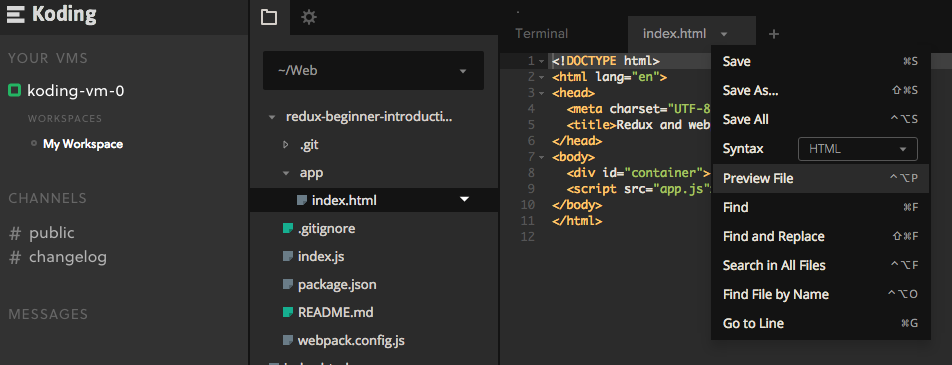
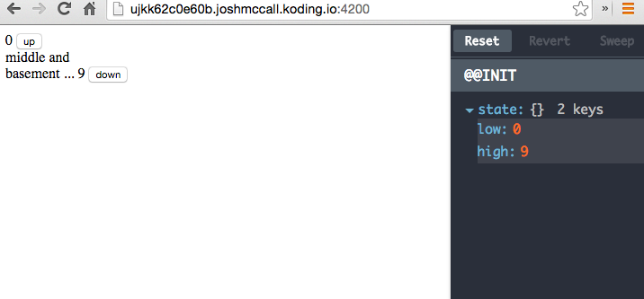

##Simple redux starter example for dsmjs (jan 12th 2016) [](https://www.npmjs.com/package/markdown-toc)

- [Basic Setup](#basic-setup)
  * [Get up and running](#get-up-and-running)
  * [Web Browser](#web-browser)
  * [Checkout first commit](#checkout-first-commit)
  * [Checkout subsequent commits](#checkout-subsequent-commits)
- [Koding.com](#koding)
  * [Follow along with (60 sec setup)](#koding)
  * [Bring up local server](#bring-up-local-server)
  * [Refresh local directory](#refresh-local-directory)
  * [Open Index](#open-index)
  * [Preview File](#preview-file)
  * [Change URL](#change-url)

# Basic Setup
## Get up and running:
```bash
$ git clone https://github.com/toranb/redux-beginner-introduction.git
$ cd redux-beginner-introduction/
$ npm install
$ npm run dev
```
## Web Browser: 
```bash
http://localhost:4200
```

## Checkout first commit

```bash
$ git checkout --detach $(git log master --format=%H --grep='starting')
```
##Checkout subsequent commits
```bash
$ git checkout --detach $(git log master --format=%H --grep='step 1:')
$ git checkout --detach $(git log master --format=%H --grep='step 2:')
$ git checkout --detach $(git log master --format=%H --grep='step 3:')
etc...
```

<br /><br />

* * *

# Koding
## Follow along with - 60 sec setup

	


####Sign in/up if you don't hav an account (log in with github account)

	

```bash
$ cd Web/
$ git clone https://github.com/toranb/redux-beginner-introduction.git
$ cd redux-beginner-introduction/
$ npm install
```


####Bring up local server
```bash
$ npm run dev
```


####Refresh local directory

####Open Index

####Preview File

####Change URL
```
From: http://ujkk62c0e60b.joshmccall.koding.io//redux-beginner-introduction/app/index.html
To:http://ujkk62c0e60b.joshmccall.koding.io:4200/
```
	

TADA!!!
